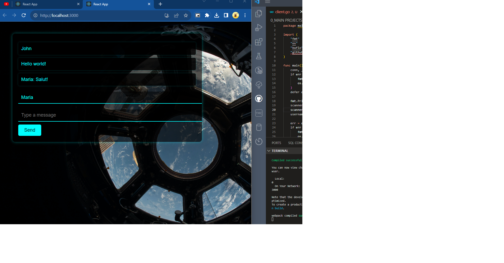

# Sci-Fi Chat Application

Welcome to the Sci-Fi Chat Application, a futuristic chat system that integrates a WebSocket server, a Go client, and a React front-end. This README provides a comprehensive guide to understanding and using these components to create a real-time chat experience.



## Table of Contents

- [Project Overview](#project-overview)
- [WebSocket](#websocket)
- [Go Server](#go-server)
  - [WebSocket in Go](#websocket-in-go)
- [Go Client](#go-client)
- [React Application](#react-application)
- [Using the Application](#using-the-application)
- [Contributing](#contributing)
- [License](#license)

## Project Overview

The Sci-Fi Chat Application is a unique chat system that combines several components to create a futuristic chat experience. Here's an overview of these components:

### WebSocket

WebSocket is a communication protocol that enables real-time, bidirectional data transfer. It is used to establish a persistent connection between the Go server and the React application, allowing instant messaging without the overhead of traditional HTTP polling.

### Go Server (`server.go`)

The Go server is the backend component responsible for handling WebSocket connections and managing chat messages. It serves as the intermediary between the WebSocket client and the React application.

#### WebSocket in Go

The Go server leverages the Gorilla WebSocket library to handle WebSocket connections. This library simplifies WebSocket implementation in Go and ensures efficient real-time communication. It facilitates the exchange of messages between clients and the server.

### Go Client (`client.go`)

The Go client is a command-line tool that connects to the WebSocket server, enabling users to send and receive messages in the chat. It acts as a chat interface and demonstrates the WebSocket communication capabilities.

### React Application (`<Your-React-App>`)

The React application is the user-friendly front-end interface that offers a modern and sci-fi-themed design for chatting with the server. It provides an immersive chat experience through a web-based interface.

## Using the Application

To use the Sci-Fi Chat Application, follow these steps:

1. **Server**: Start the Go server by running `server.go`. It will listen on port 8080 and handle WebSocket connections from clients.

    ```shell
    go run server.go
    ```

2. **Client**: Start the Go client by running `client.go`. It connects to the WebSocket server and allows you to enter your username and chat.

    ```shell
    go run client.go
    ```

3. **React Application**: Set up the React application by navigating to the `<Your-React-App>` directory and installing dependencies. Then start the application.

    ```shell
    cd <Your-React-App>
    npm install
    npm start
    ```

4. **Usage**: Open a web browser and access the React application at `http://localhost:3000`. You can enter your username, send messages, and enjoy the sci-fi chat experience.

## License

This project is licensed under the MIT License. See the [LICENSE](LICENSE) file for details.
